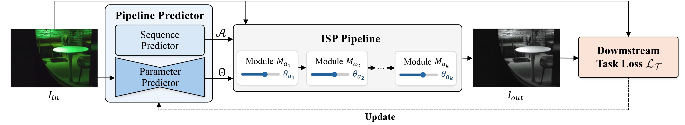

# [CVPR 2026 Findings] POS-ISP: Pipeline Optimization at the Sequence Level for Task-aware ISP

<p align="center">
<a href="https://w1jyun.github.io/">Jiyun Won</a><sup>1</sup> &nbsp;&nbsp;
<a href="https://hmyang0727.github.io/">Heemin Yang</a><sup>1</sup> &nbsp;&nbsp;
<a href="https://woo525.github.io/">Woohyeok Kim</a><sup>2</sup> &nbsp;&nbsp;
<a href="https://sites.google.com/view/jungseulok">Jungseul Ok</a><sup>1,2</sup> &nbsp;&nbsp;
<a href="http://www.scho.pe.kr">Sunghyun Cho</a><sup>1,2</sup>
</p>

<p align="center">
POSTECH CSE<sup>1</sup> & GSAI<sup>2</sup>
</p>

<p align="center">
  <a href="https://w1jyun.github.io/POS-ISP/">Project Page</a>
  &nbsp;|&nbsp;
  <a href="https://arxiv.org/abs/2604.06938">Paper</a>
</p>



Official repository for **POS-ISP**, a sequence-level reinforcement learning framework for task-aware ISP optimization.


## Overview

Task-aware ISP optimization aims to adapt image signal processing pipelines for downstream vision tasks. Prior approaches usually optimize ISP modules stage by stage, which can lead to unstable training and high computational cost.

POS-ISP formulates ISP optimization as a **sequence-level prediction problem**. The model predicts the full ISP pipeline and all module parameters in a single forward pass, and optimizes them using the terminal downstream-task reward. This design improves optimization stability while keeping the predictor lightweight and efficient.

Following the formulation in the paper, POS-ISP predicts:

- A **task-level ISP module sequence**
- **Image-adaptive parameters** for each input image

This repository provides the current code for:

- Object detection on `LOD`
- Instance segmentation on `LIS`
- Monocular depth estimation on `KITTI`

The core entry points are [train_detection.py](C:\Users\yun\POS-ISP\train_detection.py), [train_segmentation.py](C:\Users\yun\POS-ISP\train_segmentation.py), [train_depth.py](C:\Users\yun\POS-ISP\train_depth.py), [test_detection.py](C:\Users\yun\POS-ISP\test_detection.py), [test_segmentation.py](C:\Users\yun\POS-ISP\test_segmentation.py), and [test_depth.py](C:\Users\yun\POS-ISP\test_depth.py). The POS-ISP policy is implemented in [agent.py](C:\Users\yun\POS-ISP\agent.py), and pretrained checkpoints are provided under [weights](C:\Users\yun\POS-ISP\weights).

## Installation

Install the main dependencies with:

```bash
pip install -r requirements.txt
```

If you use a CUDA environment, it is recommended to install `torch` and `torchvision` first using the official PyTorch instructions, then install the remaining packages from `requirements.txt`.

## Data

### Object Detection: LOD

Object detection uses:

```text
yolov3/data/lod.yaml
```

Download sources:

- [AdaptiveISP Repository](https://github.com/OpenImagingLab/AdaptiveISP)
- [LOD Dataset Download](https://onedrive.live.com/?id=FD75B81D284B4FAD%21115&resid=FD75B81D284B4FAD%21115&e=KURDwo&migratedtospo=true&redeem=aHR0cHM6Ly8xZHJ2Lm1zL3UvcyFBcTFQU3lnZHVIWDljekhCOVdrVU5VVFV4OG8%5FZT1LVVJEd28&cid=fd75b81d284b4fad&v=validatepermission)

In the paper, the main detection settings are reported on **LOD-Dark** and **LOD-All**.

### Instance Segmentation: LIS

Instance segmentation uses:

```text
yolov3/data/lis_raw_all.yaml
```

Download source:

- [LIS Repository](https://github.com/Linwei-Chen/LIS)

In the paper, the main instance segmentation settings are reported on **LIS-Dark** and **LIS-All**.

### Monocular Depth Estimation: KITTI_depth

Depth dataset paths are configured in [config.py](C:\Users\yun\POS-ISP\config.py):

```python
cfg.depth_train_dir = 'Dataset/kitti/KITTI_depth/KITTI_sc'
cfg.depth_test_dir = 'Dataset/kitti/KITTI_depth/kitti_depth_test'
```

`KITTI_depth` is the same synthetic RAW KITTI setup used in DRL-ISP.

Download source:

- [KITTI_depth Download](https://kaistackr-my.sharepoint.com/personal/shinwc159_kaist_ac_kr/_layouts/15/onedrive.aspx?id=%2Fpersonal%2Fshinwc159%5Fkaist%5Fac%5Fkr%2FDocuments%2FDRL%5FISP%2FDRL%5FISP%5FRAW&ga=1)

## Weights

### POS-ISP checkpoints

Pretrained POS-ISP checkpoints are provided in [weights](C:\Users\yun\POS-ISP\weights):

```text
weights/lod-PosISP_iter_15000.pth
weights/lod-raw_all_PosISP_iter_15000.pth
weights/lis-raw_dark_PosISP_iter_15000.pth
weights/lis-raw_all_PosISP_iter_15000.pth
weights/kitti_PosISP_iter_15000.pth
```

### Depth backbone

Depth training and testing use `DispResNet(18, False)` from [depth](C:\Users\yun\POS-ISP\depth), based on [SC-SfMLearner-Release](https://github.com/JiawangBian/SC-SfMLearner-Release).

Download the pretrained depth weight from that repository and place it at:

```text
depth/weight/dispnet_model_best.pth.tar
```

## Training

### Object Detection

```bash
python train_detection.py \
    --data_name=lod \
    --data_cfg=yolov3/data/lod.yaml \
    --save_dir_name=experiments \
    --save_path=posisp_det
```

### Instance Segmentation

```bash
python train_segmentation.py \
    --data_name=lis \
    --data_cfg=yolov3/data/lis_raw_all.yaml \
    --save_dir_name=experiments \
    --save_path=posisp_seg
```

### Monocular Depth Estimation

```bash
python train_depth.py \
    --data_name=kitti \
    --depth_weights=depth/weight/dispnet_model_best.pth.tar \
    --save_dir_name=experiments \
    --save_path=posisp_depth
```

## Testing

### Object Detection on LOD

```bash
python test_detection.py \
    --project=results \
    --name=lod_eval \
    --isp_weights=weights/lod-PosISP_iter_15000.pth \
    --data=yolov3/data/lod.yaml \
    --batch-size=1 \
    --save_image \
    --save_param
```

### Object Detection on LOD-All

```bash
python test_detection.py \
    --project=results \
    --name=lod_raw_all_eval \
    --isp_weights=weights/lod-raw_all_PosISP_iter_15000.pth \
    --data=yolov3/data/lod_raw_all.yaml \
    --batch-size=1 \
    --save_image \
    --save_param
```

### Instance Segmentation on LIS-Dark

```bash
python test_segmentation.py \
    --project=results \
    --isp_weights=weights/lis-raw_dark_PosISP_iter_15000.pth \
    --data_name=lis \
    --data=yolov3/data/lis_raw_dark.yaml \
    --batch-size=1 \
    --steps=5 \
    --name=lis_raw_dark \
    --save_image \
    --save_param
```

### Instance Segmentation on LIS-All

```bash
python test_segmentation.py \
    --project=results \
    --isp_weights=weights/lis-raw_all_PosISP_iter_15000.pth \
    --data_name=lis \
    --data=yolov3/data/lis_raw_all.yaml \
    --batch-size=1 \
    --steps=5 \
    --name=lis_raw_all \
    --save_image \
    --save_param
```

### Monocular Depth Estimation on KITTI

```bash
python test_depth.py \
    --project=results \
    --isp_weights=weights/kitti_PosISP_iter_15000.pth \
    --batch-size=1 \
    --name=kitti \
    --save_image \
    --save_param
```

## Notes

- `test_depth.py` loads the depth backbone from `depth/weight/dispnet_model_best.pth.tar` by default.
- Test results are saved under the directory specified by `--project` and `--name`.
- ISP checkpoints are loaded from the `agent_model` key in the saved checkpoint.
- The paper uses the task names **object detection**, **instance segmentation**, and **monocular depth estimation**.
- The paper reports results mainly on **LOD-Dark / LOD-All** and **LIS-Dark / LIS-All**.

## Citation

```bibtex
@inproceedings{won2026posisp,
  title={POS-ISP: Pipeline Optimization at the Sequence Level for Task-aware ISP},
  author={Won, Jiyun and Yang, Heemin and Kim, Woohyeok and Ok, Jungseul and Cho, Sunghyun},
  booktitle={Proceedings of the IEEE/CVF Conference on Computer Vision and Pattern Recognition (CVPR) Findings},
  year={2026}
}
```

## Acknowledgements

This repository builds on or uses ideas, code, models, or datasets from the following projects:

- [AdaptiveISP](https://github.com/OpenImagingLab/AdaptiveISP)
- [DRL-ISP](https://github.com/UkcheolShin/DRL-ISP)
- [LOD Dataset](https://github.com/ying-fu/LODDataset)
- [LIS Dataset](https://github.com/Linwei-Chen/LIS)
- [YOLO](https://github.com/ultralytics/ultralytics)
- [SC-SfMLearner-Release](https://github.com/JiawangBian/SC-SfMLearner-Release)
